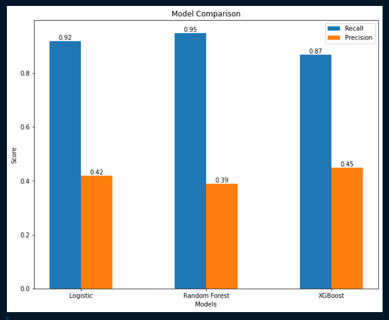
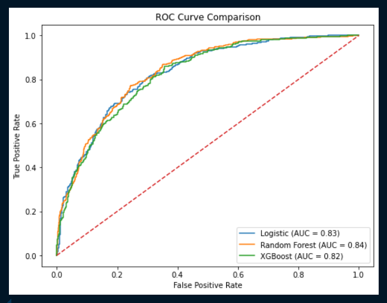

# 📉 Customer Churn Prediction (Machine Learning Project)

## 📌 Problem Statement
Predict whether a customer will churn (leave the service) based on their behavior and service usage data.

## 📊 Dataset
- 7043 rows, 21 columns
- Target Variable: `Churn` (Yes/No)
- Imbalanced dataset

## 🧠 Project Workflow

1. Data Cleaning & Preprocessing
   - Converted data types (e.g., TotalCharges)
   - Handled missing values
   - Encoded categorical features using appropriate techniques

2. Handling Imbalanced Data
   - Identified class imbalance in target variable (Churn)
   - Applied class weights
   - Used threshold tuning to improve recall

3. Model Building
   - Logistic Regression
   - Random Forest
   - XGBoost

4. Model Evaluation
   - Confusion Matrix
   - Precision & Recall
   - ROC-AUC Curve

---

## 📊 Results

| Model | Recall | Precision | AUC |
|------|--------|----------|-----|
| Logistic Regression | 0.92 | 0.42 | 0.83 |
| Random Forest ⭐ | **0.95** | 0.39 | **0.84** |
| XGBoost | 0.87 | 0.45 | 0.82 |

---

## 🏆 Final Model
**Random Forest** was selected as the final model because it achieved the highest recall (95%), ensuring maximum churn detection.

---

## 📈 Key Learnings

- Accuracy is misleading for imbalanced datasets
- Recall is critical in churn prediction
- Threshold tuning improves performance
- Model selection depends on business goals

---

## 📸 Visualizations

---

## 🛠️ Tech Stack

- Python
- Pandas, NumPy
- Scikit-learn
- XGBoost
- Matplotlib

---

## 👨‍💻 Author

**Prashant Maurya**
